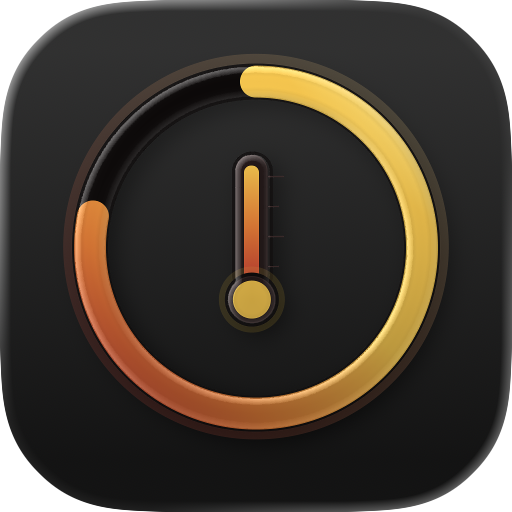

# MacVitals

A lightweight macOS menu bar app for monitoring system vitals — CPU, Memory, Storage, Battery, Thermals, and Uptime.


## Features

- **CPU** — Total, user, and system usage with per-core breakdown and top processes
- **Memory** — Usage breakdown (active, wired, compressed), memory pressure, and top consumers
- **Storage** — Disk usage with real-time read/write speeds
- **Battery** — Charge level, health, cycle count, and time remaining
- **Thermals** — CPU/GPU temperatures and fan speeds via SMC
- **Uptime** — System uptime at a glance

## Screenshots



## Requirements

- macOS 15.0+
- Xcode 16+

## Installation

### GitHub Releases

Download the latest `.dmg` from [Releases](https://github.com/owieth/MacVitals/releases).

### Build from Source

```bash
git clone https://github.com/owieth/MacVitals.git
cd MacVitals
xcodebuild -project MacVitals.xcodeproj -scheme MacVitals -configuration Release build
```

## Architecture

MacVitals runs as a menu bar–only app (no dock icon). Click the icon to open a popover with live system stats organized in expandable sections.

```
MacVitals/
├── Models/          # Data models (CPUInfo, MemoryInfo, etc.)
├── Services/        # System data collectors + orchestrator
├── ViewModels/      # @Observable view models
├── Views/           # SwiftUI views (popover, sections, settings)
└── Utilities/       # Preferences, formatters, constants
```

### Data Collection

| Metric  | API                                          |
|---------|----------------------------------------------|
| CPU     | `host_processor_info()` delta sampling       |
| Memory  | `host_statistics64()` VM info                |
| Storage | `FileManager` + IOKit disk I/O               |
| Battery | IOKit `IOPSCopyPowerSourcesInfo`             |
| Thermal | SMC via IOKit (`AppleSMC`)                   |
| Process | `proc_pidinfo` / `proc_pid_rusage`           |

## Settings

- **Refresh rate** — 1s, 2s (default), or 5s
- **Menu bar display** — Icon only, icon + CPU%, or icon + temperature
- **Temperature unit** — °C or °F
- **Launch at login** — via `SMAppService`
- **Visible sections** — Show/hide individual sections

## License

MIT

## Acknowledgments

Inspired by [Stats](https://github.com/exelban/stats) and [Lazy Stats](https://github.com/aspect-build/lazy-stats).
